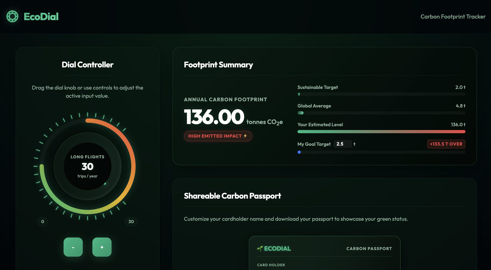
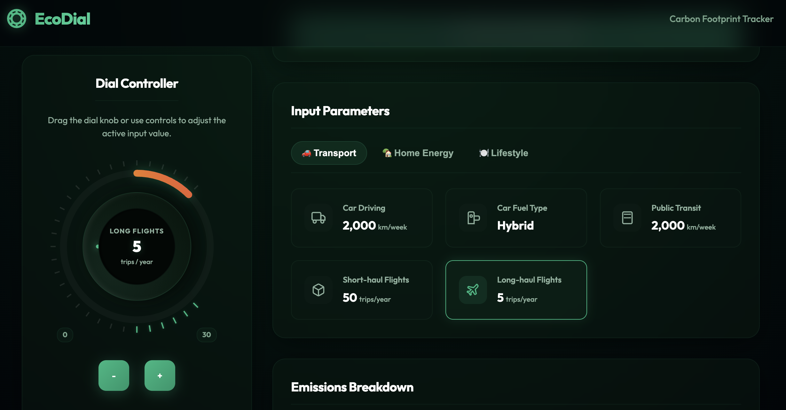
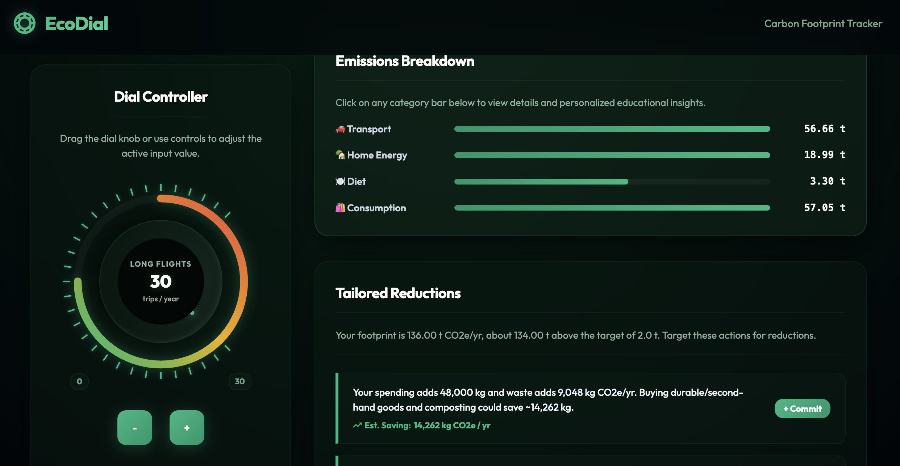
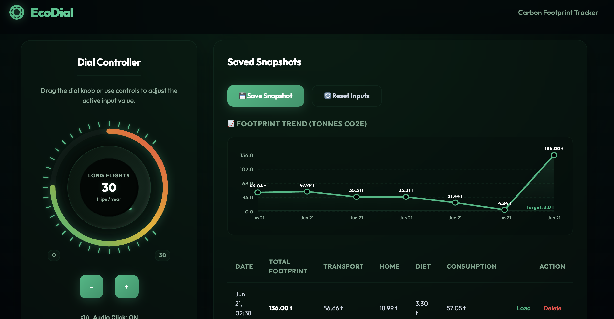
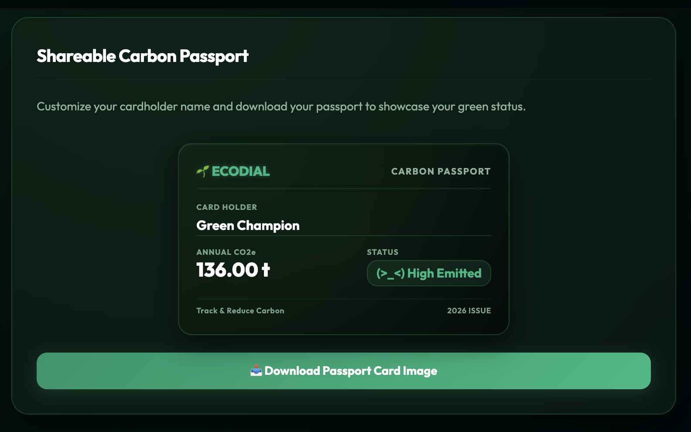
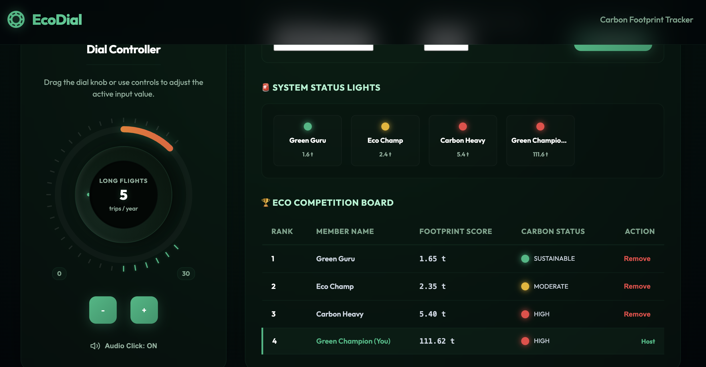

# 🌱 EcoDial — Interactive Carbon Footprint Console

**Live Web Application**: [https://ecodial-484628711205.us-central1.run.app](https://ecodial-484628711205.us-central1.run.app)

> [!NOTE]
> This application is proud to be **100% vibe coded** — built via iterative partner collaboration, leveraging state-of-the-art AI-driven design, rapid prototyping, and automated software agents to achieve pristine engineering, security compliance, and WCAG AA accessibility.

---

## 📸 Screenshots

| Interactive Dashboard | Tactile Input Parameters | Emissions Category Breakdown |
| :---: | :---: | :---: |
|  |  |  |
| **Saved Snapshots & SVG Trend** | **Shareable Carbon Passport** | **Community Leaderboard** |
|  |  |  |

---

## 🎯 Chosen Vertical
This solution addresses the **Individual Carbon Footprint Awareness & Reduction** vertical. The platform is designed to engage individuals with highly tactile controls, immediate visual feedback, and personalized, quantified recommendations to help them track and systematically lower their annual greenhouse gas emissions.

---

## 💡 Approach and Logic
EcoDial is built as a **decoupled, secure full-stack application** consisting of a Python FastAPI backend and a static HTML/CSS/JS frontend.

### Core Architecture:
1. **Separation of Concerns**:
   - **Frontend**: A highly responsive Single Page Application (SPA). Dial knob controls are bound to drag and arrow key inputs, updating calculations instantly. Employs the browser's Web Audio API for interactive audio clicks and Canvas API to compile and render a shareable PNG Carbon Passport on-demand.
   - **Backend**: Python FastAPI web server that handles API requests, serves static files, validates parameters using Pydantic, and runs calculations.
2. **Server-Side Math & Security**:
   - Rather than relying solely on easily modifiable client-side JavaScript calculations, all footprint totals are computed server-side to guarantee integrity.
   - Inputs are validated using strict boundary ranges (Pydantic schemas) to block invalid requests (e.g. negative inputs).
3. **High-Availability Fallback**:
   - If the FastAPI backend goes offline, the frontend client automatically catches the error and switches to offline mode, falling back to local calculation logic and `localStorage` to ensure the platform remains fully functional.
4. **Community Sync**:
   - A server-side database (`database.json`) is maintained to synchronize leaderboard scores across members, keeping user competition fair.

---

## ⚙️ How the Solution Works

### The User Journey:
1. **Tactile Inputs**: Users adjust inputs across three tabs (**Transport**, **Home Energy**, and **Lifestyle**) using a slider-style dial knob or manual adjustment buttons (`+` / `-`).
2. **Real-time Scoring & Comparison**: As variables shift, the console calculates the estimated annual footprint (in tonnes of CO2e) and updates visual progress bars comparing user performance against global averages and sustainable targets.
3. **Tailored Recommendations**: The platform sorts emission categories dynamically to display quantified, actionable reduction steps (e.g., swapping to an EV, shifting diet profiles).
4. **Saved Snapshots**: Users can save snapshot estimates locally to observe progress over time.
5. **Eco Passport Card**: Users can input their name and download a canvas-rendered Carbon Passport Card to share on social media.
6. **Eco Leaderboard**: Users can add other members and view community standings in real-time, backed by color-coded status LEDs indicating compliance with environmental targets.

---

## 🧮 Assumptions and Emission Factors
The calculation engine utilizes standardized coefficients derived from environmental reporting standards:
- **Car Fuel Emissions**:
  - Petrol: $0.170\text{ kg CO}_2\text{e per km}$
  - Diesel: $0.171\text{ kg CO}_2\text{e per km}$
  - Hybrid: $0.120\text{ kg CO}_2\text{e per km}$
  - Electric: $0.047\text{ kg CO}_2\text{e per km}$
- **Public Transit**: $0.060\text{ kg CO}_2\text{e per km}$
- **Aviation**:
  - Short-haul ($<1100\text{ km}$): $0.158\text{ kg CO}_2\text{e per km}$
  - Long-haul ($\ge 1100\text{ km}$): $0.150\text{ kg CO}_2\text{e per km}$
- **Home Energy**:
  - Electricity: $0.450\text{ kg CO}_2\text{e per kWh}$
  - Natural Gas: $0.183\text{ kg CO}_2\text{e per kWh}$
  - *Note: Home energy is divided by the household size to estimate individual footprint.*
- **Diet Profiles**:
  - Heavy Meat: $3,300\text{ kg CO}_2\text{e/year}$
  - Medium Meat: $2,500\text{ kg CO}_2\text{e/year}$
  - Low Meat: $1,900\text{ kg CO}_2\text{e/year}$
  - Pescatarian: $1,700\text{ kg CO}_2\text{e/year}$
  - Vegetarian: $1,500\text{ kg CO}_2\text{e/year}$
  - Vegan: $1,050\text{ kg CO}_2\text{e/year}$
- **Consumption & Waste**:
  - Consumer Goods Spend: $0.40\text{ kg CO}_2\text{e per USD}$
  - Landfill Waste: $0.580\text{ kg CO}_2\text{e per kg}$

---

## 🛠️ Setup & Running

### Option A: Run locally using Docker Compose
```bash
docker-compose up --build
```
* **Frontend client**: Available at `http://localhost:8080`
* **Backend API server**: Available at `http://localhost:8000`

### Option B: Run locally using standard Python
1. **Backend**:
   ```bash
   cd backend
   python3 -m venv .venv
   source .venv/bin/activate
   pip install -r requirements.txt
   uvicorn app.main:app --host 0.0.0.0 --port 8000
   ```
2. **Frontend**:
   ```bash
   cd frontend
   python3 -m http.server 8080
   ```
   Then visit `http://localhost:8080` in your web browser.

---

## 🧪 Testing
The backend features an automated test suite containing unit tests for the calculator logic and API integration tests for the endpoints.

To run tests locally:
```bash
cd backend
source .venv/bin/activate
python3 -m pytest
```
*Tests cover boundary validations, division checks, state deletions, and calculating default payloads.*
